# Shell Scripting Tutorial

#### by Muhammad Waleed Akram
---

## Introduction

Shell scripting is the art of telling efficiently your operating system(OS) exactly what to do.  
This tutorial aims to take you from basic shell scripting to a level where you can comfortably automate complex tasks and work like a real system engineer.


---

## What Exactly is a Shell?

A **shell** is an interface between you and the kernel.  
It takes commands you type and executes them on your behalf.

Some popular shells are:
- **Bash** (Bourne Again Shell)
- **Zsh**
- **Fish**

Shell scripting is simply writing multiple shell commands into a file so that they can run sequentially.

---

## 1.Setting Up

First, ensure you have access to a shell environment:

- Linux/macOS: Open the Terminal
- Windows: Use Git Bash or WSL (Windows Subsystem for Linux) . I am using Ubuntu because RiscV tools work well with them.. 

Check your shell:

```bash
echo $SHELL
```

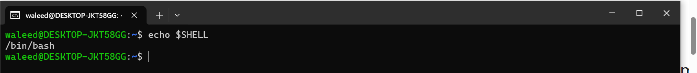

## 2.Your First Script

##### Create a file named `myscript.sh`:
```bash
vim myscript.sh
```
(Make sure you have vim otherwise you may use `nano myscript.sh`) . if using vim click on `i` and then type 
```bash
#!/bin/bash
echo "Hello, Shell World!"
```
and then type `Esc` and then `:wq` it will write and quit 

just like below 

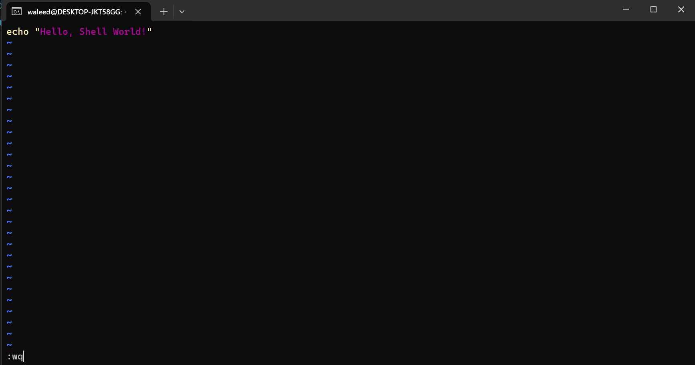

### Understanding the Script Line-by-Line
`#!/bin/bash` : This is called a shebang. It tells the system which interpreter to use.

`echo` : Used to print output.

## 3.Working with Files and Directories
#### Create a directory:
To create a new directory , use `mkdir` as:

```bash
mkdir new_project
```

#### Move into a directory:
To move into a directory , use `cd` as:
```bash
cd new_project
```

#### Getting the list of files inside the current directory:
to get the list of files inside current directory , use `ls` as:

```bash
ls
```
Since you have just made it so it'll be empty for now . Don't panic

#### Create multiple files:
To create a file / multiple files , use `touch` as:
```bash
touch file{1..5}.txt
```

#### Remove files:
To remove a file , use `rm` as:
```bash
rm file1.txt
```

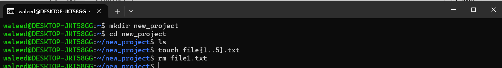

#### Remove directory:
To remove a directory , use `rmdir` as:
```bash
rmdir new_project
```


## 4.Command-Line Power: Pipes and Redirection
#### Pipe (|):
It connects output of one command into another.

```bash
ls | grep "project"
```
grep is used to search text in file (has been exaplained in this tutorial )

#### Redirection (> and >>):
It sends output to a file.
```bash
echo "Backup complete" > backup.log
```

You may wonder that I don't have backup.log file . Don't worry it will automatically make and write "Backup Complete" there . It is its beauty!!

###### You can see inside of a file by `cat` command

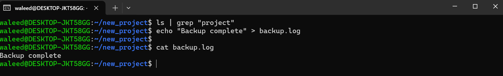


## 5.File Manipulation
First let write a pargraph in one of our files to observe the changes . 
I am writing paragraph in file1.txt

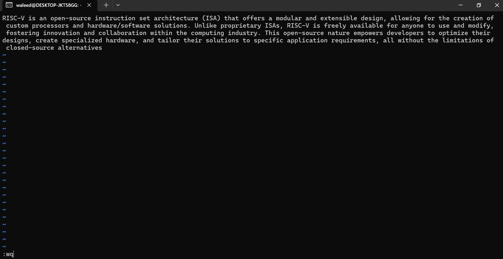

#### Viewing file
###### View entire file
Use `cat` command for viewing entire file.
```bash
cat filename.txt
```


###### View first 2 lines
For viewing from head ,use `head -n ` as:
```bash
head -n 2 filename.txt
```


###### View last 3 lines
For viewing from tail , use `tail -n ` as:
```bash
tail -n 3 filename.txt
```
#### EXAMPLE:
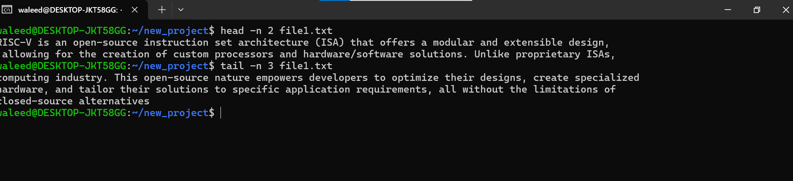

#### Copying/Moving File
###### Copy file
To copy file ,use `cp` like :
```bash
cp source.txt destination.txt
```
###### Move/rename file
To move/rename file , use `mv` as:
```bash
mv oldname.txt newname.txt
```

###### Move file to different directory
To move file to different directory , use `mv` as:
```bash
mv file.txt /path/to/directory/
```
#### EXAMPLE
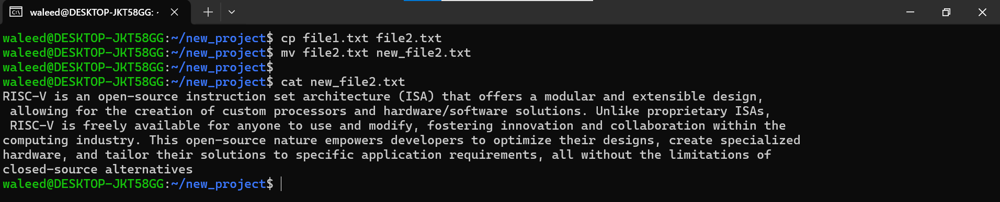


## 6.Working with Text Files
###### grep:
Use `grep` to search for some text in a file .
##### For Instance:
Search for "computing" in text1.txt file
```bash
grep "computing" file1.txt
```
###### cut:
To cur some specific part from a file , use `cut` like :
Get characters 5-10 from each line
```bash
cut -c5-10 file1.txt
```
###### paste:
To ,erge two files line by line , use `paste` as:
```bash
paste file1.txt backup.log
```
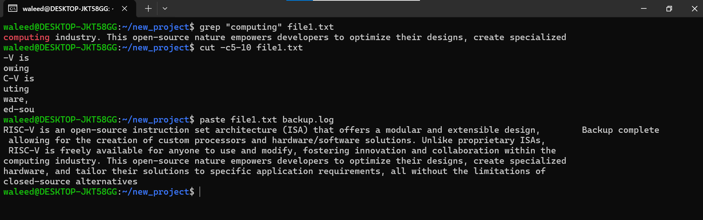

## 7.Variables and Substitution

- **Variables do not need types:**
    ```bash
    name="Waleed"
    echo "Hello, $name!"
    ```


## 8.Input and Output

- **Reading from the user:**
    ```bash
    read -p "Enter your city: " city
    echo "You live in $city"
    ```
- **Redirecting output:**
    ```bash
    echo "This is a log entry" >> logfile.txt
    ```


## 9.Control Structures

### If-Else Statements
- make a file using i.e: `vim num.sh`
- type `i` then write below code 
- type `Esc`
- type `:wq`
- then type `enter` 
```bash
read -p "Enter a number: " num
if [ $num -gt 0 ]; then
    echo "Positive number"
elif [ $num -lt 0 ]; then
    echo "Negative number"
else
    echo "Zero"
fi
```
`fi` means "Ends if statement" and `;` is Command separator 

- To run it use `bash num.sh`
### EXAMPLE
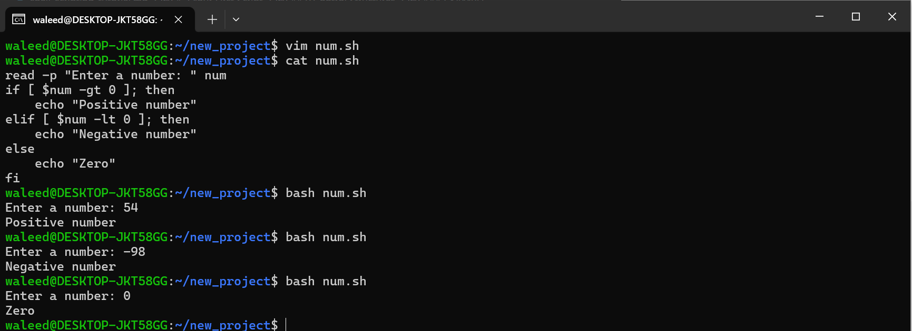

## 10.Bash Comparison Operators Cheat Sheet

| Operator  |Meaning   |
|---|---|
|  -gt | Greater Than  |
|  -lt |  Less Than |
|  -ge |  Greater Than or Equal |
|  -le |  Less Than or Equal |
|  -eq |  Equal (numbers) |
|  -ne |  Not Equal (numbers) |
|  == |  Equal (strings) |
|  != |   Not Equal (strings)	|
|  -z |   Empty string|
|  -n |   Non-empty string|
|   -w|   Writable|
|  -x |   Executable|
|   -r|  Readable |
|   -d|  	Directory |


## 10.Loops
### For Loop:
#### - Basic Number Range Loop
Repeat the same steps as you did in If-Else Conditions
```bash
for i in {1..5}; do
    echo "Number: $i"
done
```
You will get output like :
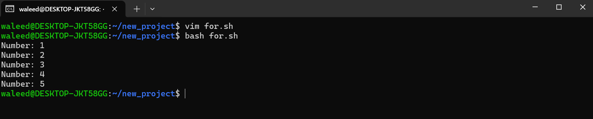

#### - Loop Through Files
```bash
for file in *.txt; do
    echo "Found file: $file"
    wc -l "$file"  # Count lines
done
```
#### -  C-Style Loop with Math
#### E.g: Power of 2
```bash
for (( i=0; i<=5; i++ )); do
    power=$(( 2**i ))
    echo "2^$i = $power"
done
```

You wil get Output like: 
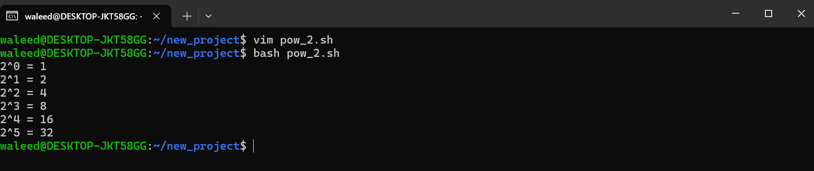

### While Loop:
```bash
count=1
while [ $count -le 5 ]
do
    echo "Count: $count"
    ((count++))
done
```

You will get Output like: 
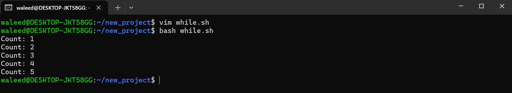

## 11.Functions
Use functions to keep scripts modular and clean.
```bash
greet() {
    echo "Welcome, $1!"
}
greet "Waleed"
```

You will get Output like:
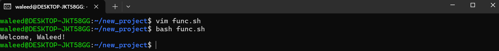


## 12.Conclusion:
This tutorial provides a complete beginner-friendly journey into shell scripting, covering everything from basic commands to functions and loops. Along the way, I included my own screenshots to make the concepts even easier to understand and to support students in practical learning. With consistent practice, you will be able to automate tasks and work confidently like a real system engineer. Keep exploring and scripting, your Linux journey has just begun!

## Further Resources
[Linux Handbook: Bash Test Operators](https://linuxhandbook.com/bash-test-operators/)

[Microsoft Shell Training](https://learn.microsoft.com/en-us/training/paths/shell/)

[MIT Missing Semester: Shell](https://missing.csail.mit.edu/2020/course-shell/)

[MIT Missing Semester: Shell Tools](https://missing.csail.mit.edu/2020/shell-tools/)

